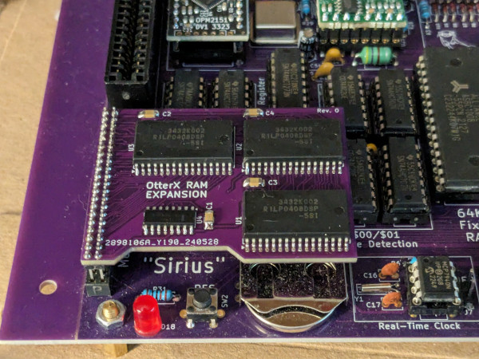

# OtterX RAM Expansion

## Introduction

This card expands the RAM of your [OtterX](https://www.tindie.com/products/wavicle/otterx-8-bit-retro-computer/) (a DIY CommanderX16 compatible) computer to 2MB!

Once You install this, and switch [J27](https://github.com/RetroRemake/OtterX_Assembly/blob/main/OtterX%20Schematics.pdf) to enable the external RAM, the computer will automatically detect the 2MB.

### Disclaimer

I take NO responsibility for what happens if you decide to build and use this card. Your computer might crash, catch fire or be destroyed in other nasty ways.
You're encourauged to take what you deem fit from this, and use it in your projects!

## Known Issues

### Rev. 0

- None

## Bill of Materials

| Component         | Qty | Type / Value           | Link                                                     |
| ----------------- | --- | ---------------------- | -------------------------------------------------------- |
| C1, C2, C3, C4    |  4  | 100nF / 1206 / ceramic | https://www.mouser.it/ProductDetail/581-1206YC104JAT2A   |
| U4                |  1  | 74AC139 / SOIC-16      | https://www.mouser.it/ProductDetail/863-MC74AC139DR2G    |
| U1, U2, U3        |  3  | 512Kx8 SRAM / SOP-32   | https://www.mouser.it/ProductDetail/968-R1LP0408DSP5SIS1 |
| J1                |  1  | 2x20 header, 2mm pitch | https://www.mouser.it/ProductDetail/200-MTMM12004TD157 or https://www.mouser.it/ProductDetail/200-MTMM12009LD350 |

Depending on whether you added or not a socket for the IC in the area where the expansion is installed, select one type of header or the other: `MTMM-120-09-L-D-350` clears the height for the sockets and the ICs.